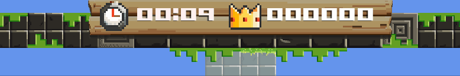
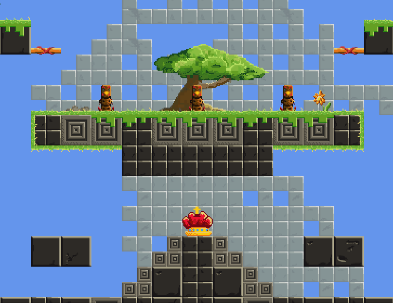

+++
date = '2017-04-15T14:51:57+01:00'
draft = false
title = 'The Prabbits: Catch the Crown is Released!'
featuredImage = 'thumbnail.png'
+++

## Release and then move on ...

Finally! After 3 years of uneven and chaotic development (partly due to a PhD), it feels like that's the right time to finalize and ship my first video game. 
<!--more-->



Catch the Crown is the first game I made with libGDX. It is a multiplayer arena platform game. My pride is that it feels like I am shipping an actual game: it can be run, played and it delivers fun (to my friends at least!). 
You can download it here:

<iframe frameborder="0" src="https://itch.io/embed/143493" width="552" height="167"><a href="https://nodragem.itch.io/catch-the-crown">Catch the Crown! by Nodragem</a></iframe>

- Windows, portable version ([zip-file](https://github.com/Nodragem/Catch-the-Crown/releases/download/v0.9-alpha/catchthecrown_win32.zip))
- Linux, portable version ([zip-file](https://github.com/Nodragem/Catch-the-Crown/releases/download/v0.9-alpha/catchthecrown_linux32.zip))
- Mac OS, portable version ([zip-file](https://github.com/Nodragem/Catch-the-Crown/releases/download/v0.9-alpha/catchthecrown_mac.zip))


Please find more details about customization in the [section below](#custom-id).

## The Story
I made up most of the story and gameplay with one of my best friends on a 7 hours road trip to Edinburgh :smiley:. The basic idea is that in the tribe of the Prabbits - which are half parrot, half rabbit creatures - four teenagers are undertaking their *Coming-of-Age* ritual. 



## The Gameplay
The Prabbits are spawned on a map where there is one Crown while a timer is running. Once the Crown is picked up by a Prabbit, coins, diamonds, and rubies appear across the level. Only the Prabbit with the Crown can collect them. When collected part of the money goes to the Prabbit's gold chest while the other part goes in the Crown itself. 

<figure>
    
    
    <figcaption>
        Only the Prabbit with the Crown can collect treasures
    </figcaption>
</figure>

A competition starts between Prabbits as everyone wants to catch the Crown and be able to collect gold. When the timer ends, it is the richer Prabbit that wins the turn. A Player needs to win 3 turns to win the tournament and be declared King of the Tournament (see Screenshot1).


## The Character Actions
The Prabbits can hurt each other in multiple ways. They can throw lances, slap each other, pick up another Prabbit and make a lethal throw. To slap someone increases their fatigue and fatigue marks appear on their head. The more fatigue, the longer their respawning time the next time they die. Time is precious - the longer a player is waiting to respawn, the less they can collect gold or change the outcome of the game.




## What was not implemented
Originally, Catch The Crown was thought to be a cooperative and competitive 2D platform game. A Shaman would have explained the competition rules to the teenager Prabbits. During a round, the players would have a common gold chest in addition to their own. The next level would be unlocked only if the common chest reaches a certain amount of Gold (you can still see this chest in the GUI). 

The levels would have been designed to force cooperative behavior to get more common Gold. Furthermore, the Shaman would summon creatures against which the Prabbits need to fight in cooperation. Thus, to win a tournament would encourage a competitive gameplay, while to unlock a new level would encourage a cooperative gameplay. 

Maybe later I will do a sequel where I will implement more of the stuff I wanted originally. In any case, I will probably come back with new levels for this version of the game. Hope you enjoy the game!

## Credits

I need to thank my friends for their ideas and feedback, especially:

- Arthur Portron
- Lukas Wolf
- Atanaska Nikolova

Software used:

- **libGDX** (Game Engine): https://libgdx.badlogicgames.com/
- **Gimp** (2D Graphics): https://www.gimp.org/
- **Krita** (2D Graphics/Painting): https://krita.org/en/
- **Aseprite** (2D Graphics/Animation): https://www.aseprite.org/
- **sfxr/bfxr** (Sound FX): https://www.bfxr.net/ http://www.drpetter.se/project_sfxr.html
- **Audacity** (Voice Recording and Editing): https://www.audacityteam.org/
- **LMMS** (Music): https://lmms.io/

## Customization {#custom-id}

### Asset folder
The assets are accessible and can be modified, that means you can add new levels and change the animations or sounds if you wanted to.

### Preference Files
The preference files are in the folder `preference` and they can be modified to make the game windowed or fullscreen, change the name of the characters, or even use the keyboard as input.

  * Use the **Keyboard and Mouse input**:
    
    Open the file `preferences.json` in `./preference` and replace, for instance:
    ```
    "input": "controller",
    "id_input": 2
    ```
    with:
    ```
    "input": "keyboard",
    "id_input": 1
    ```
    Note that the `id_input` of the keyboard must be set to 1.

  * Change the **names of the Prabbits**:
    
    Open the file `preferences.json` in `./preference` and replace, for instance:
    ```
    "name": "Purple",
    "color": "purple",
    ```
    with:
    ```
    "name": "MyNewName",
    "color": "purple",
    ```

  * Change **FullScreen Mode and Resolution**:  
    
    Open the file `preferences.json` in `./preference` and replace, for instance:
    ```
    "full_screen": true,
    "resolution": [1920, 1080],
    ```
    with:
    ```
    "full_screen": false,
    "resolution": [800, 600],
    ```

  * Change the Controls:
    
    The controls are mapped to actions in the files `profileController.xml` and `profileKeyBoard.xml`. Note that the Mouse controls are hard coded and cannot be modified. The numbers mapped to the buttons of your controller depend on your controller.
    Known mapping can be found [here](https://github.com/libgdx/libgdx/tree/master/extensions/gdx-controllers/gdx-controllers/src/com/badlogic/gdx/controllers/mappings).

