+++
date = '2019-12-12T21:27:08+01:00'
draft = true
title = 'Happy Dogfights: Devlog 01'
featuredImage = "prabbit-aviator-banner.png"
+++

Finally updating the demo of my next game, just in time for you to enjoy with some friends during the festive season :smiley: Hope you like it! A lot of love and time has gone into it. In description, it is much more fun and less buggy :grin: with a new level to unlock. But for those who wants to know more, I prepared a detailed changelog you can read below.
<!-- More -->

## A New Level and a Newsletter

I wanted to make a valuable gift to players who may like the game and want to join the newsletter I am planning to start (already part of my New Year's resolutions). So I developed an additional level especially for the occasion!

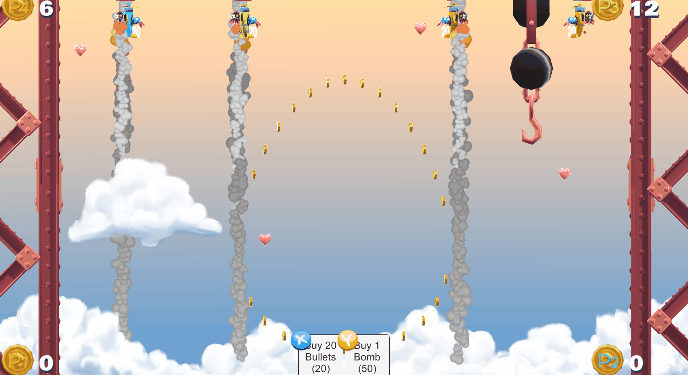

It is inspired by ironworkers and the giant crane hook they use to raise beams of steel up to the sky. Watch for the iron ball as it will be deadly.
I also designed an in-game form for players to join the newsletter. 
Hopefully, I will be speaking to you soon about the development of the game and my new gameplay and game mode ideas :) !

## Change to the Gameplay

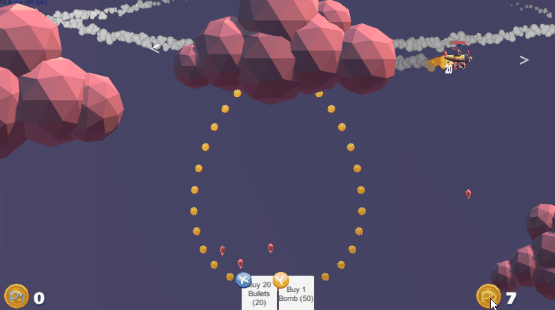

The Bomb does not eliminate a player for the whole tournament any more. This was judged too punitive; now, a bomb will eliminate a player for the next round only. Hence if you only play at two players, the player who used the bomb will win two rounds at once.



The radius of the Bomb is now shown on the screen with a red semi-transparent circle.
The bomb will explode at the end of its timer (instead of simply disappearing); when the time comes close, the red circle will flicker.

I also reduced the number of hearts and increased the time before they respawn: there were too many hearts, that made the dogfights too long.

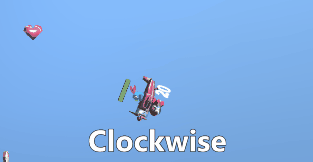

Finally the controls have changed a bit, it is now left to turn the plane anti-clockwise and right to turn the plane clockwise. The player can now control the speed of the plane with the vertical axis of the second thumbstick.

## New Local Multiplayer

You can play locally without being connected to the internet! Sounds quite normal, but before this release the game needed to connect to internet :) !

Although that's not a new feature, note that you can play at two on the same keyboard!

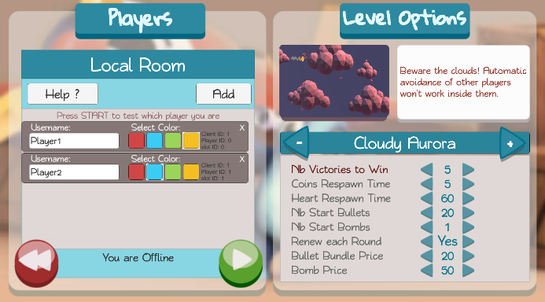

## Updated Online Multiplayer

The online multiplayer is now much closer to what exists elsewhere, with a lobby and rooms. It is still **experimental**; as I am using a free server for this free demo, ***only 20 concurrent clients can play at the same time***. Here what's new:

- new Lobby and Rooms system

- create a room with its unique name for your friends to find you easily

  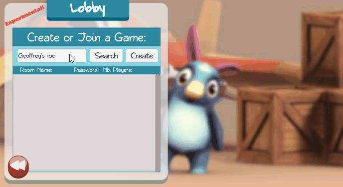

- use the search button to find the room of your friend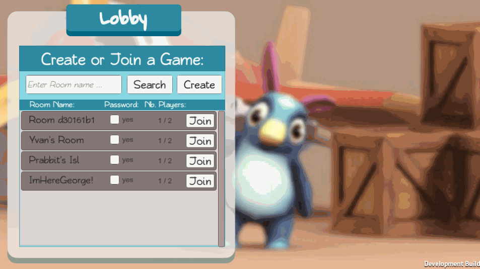

- Master client needs to wait for other clients' players to be ready

- the game still allows several players to play from the same machine

## Graphic Updates and Readability

I realised that some players did not always follow what was going on during a tournament. For instance, some players did not know who was currently leading the tournament (and hence who should be hunted). I tried to make the game more readable.

- Level 1 and Level 2 were redecorated (see below)

- a crown was added on the head of the Prabbit who won the most rounds:

  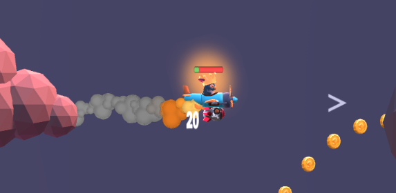

- an arrow pointing forward was added to help the player aim when shooting

- players can test which slot they are in the player list by pressing START:

  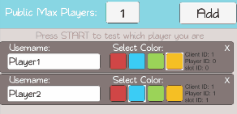

- textual announcement of who is not playing next round

- planes will emit smoke based on their remaining life (white for 50% life, black for 1% life)

- more readable leaderboard, the text "1/5 wins" was replaced with a row of stars that is easier to read

  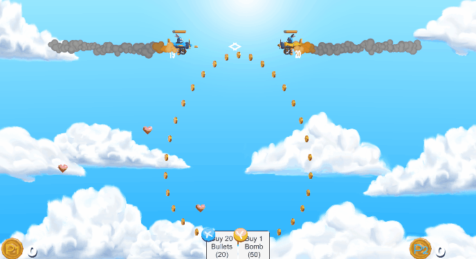

- the star animation makes the winner more visible

- "Out Next Round" is displayed in the leaderboard when players are eliminated for the next round

## UI improvement
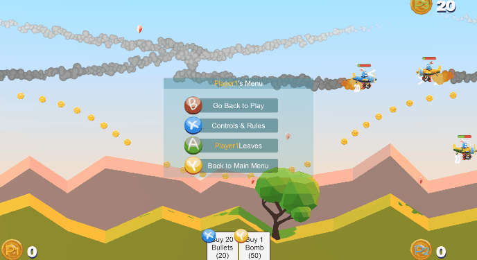

A new in-game menu allows players to go back to the level selection/lobby or see the controls.

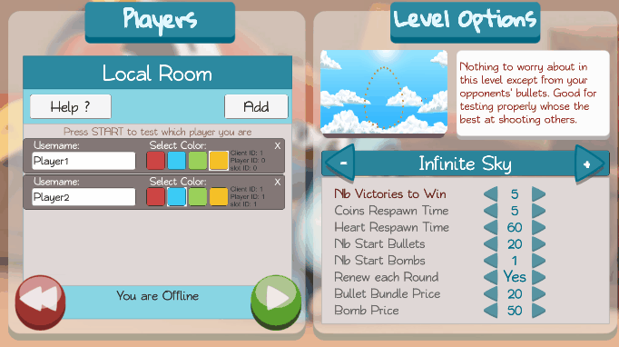

A new help panel was added to familiarise players with the control schemes and rules.

## Bug corrections
- ghost plane: after a plane was destroyed, its collision box could still be active and destroy your plane
- sometimes, to kill the last player with a bomb would make the player win the tournament
- many more... in a few words, the game should be more stable now!

## Download

You can play the demo here:  

<iframe frameborder="0" src="https://itch.io/embed/469023?border_width=2" width="554" height="169"><a href="https://nodragem.itch.io/the-prabbits-air-dogfight">The Prabbits: Happy Dogfight by Nodragem</a></iframe>

Or download it from here:

<iframe src="https://widgets.gamejolt.com/package/v1?key=Z8cUgjHM" frameborder="0" width="500" height="170"></iframe>

Don't hesitate to leave your feedback!